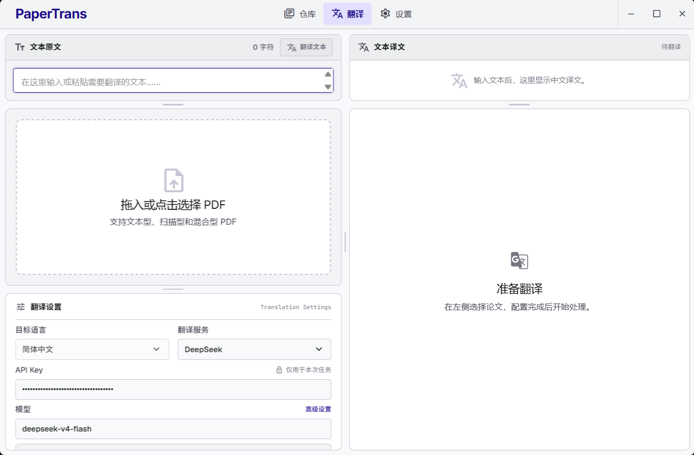
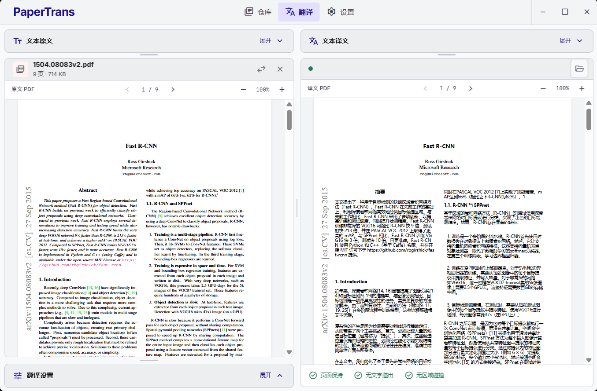
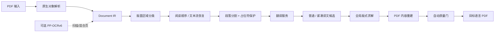

<div align="center">

# 📄 PaperTrans

### 保版式的学术论文 PDF 翻译工具

*不是简单地提取文字覆盖回去，而是重建可检查的文档结构、恢复阅读顺序，*
*并在可读性约束下尽量保持原页面的尺寸、页数、图表、公式与视觉层级。*

<br>


</div>

---

## 🖥️ 界面预览

<p align="center">
  
</p>

<p align="center"><em>统一工作区 —— 左侧文本原文 / 原文 PDF / 翻译设置，右侧文本译文 / 译文 PDF，各区域可拖拽折叠。</em></p>

<p align="center">
  
</p>

<p align="center"><em>原文与译文 PDF 逐页对照 —— 保持页面尺寸、页数、图表位置与视觉层级，段落可双击联动定位。</em></p>

示例论文为 Ross Girshick 的 [Fast R-CNN](https://arxiv.org/abs/1504.08083)。截图仅展示应用效果；论文内容版权归原作者所有，示例译文仍需人工校对。

---

## ✨ 核心特性

| 分类 | 能力 |
|------|------|
| 🌐 **多目标语言** | 简体中文、English、日本語、한국어、Français、Español、Deutsch、Русский；文本与 PDF 翻译均支持，按语言选字体、拉丁/西里尔语言按单词断行 |
| 🔌 **多翻译服务** | DeepSeek、Kimi、**智谱AI (GLM)**、任意 OpenAI 兼容接口，以及无需密钥的本地 Mock 版式测试 |
| 🔎 **模型自动检测** | 填入 API Key 后一键拉取该服务 `/models` 的可用模型，展开选择，也可手动输入 |
| 📐 **保版式排版** | 全局版式约束求解：中文标点禁则、跨区域文本流、紧凑译文候选、可控字号回退、碰撞规避 |
| 🖹 **双栏阅读联动** | 原文 / 译文 PDF.js 阅读器，逐页对照、段落双击互相定位、翻页与缩放可独立同步 |
| 🧾 **段落级保护** | 引用、URL、DOI、公式、变量、单位以稳定占位符保护并逐段校验恢复，失败即拦截 |
| 🔍 **可选本地 OCR** | 内置 PP-OCRv6 权重，仅对缺少可靠文字层的扫描/混合页启用，不联网下载 |
| 🗂️ **本地仓库** | PDF / 文本任务本地历史，规范化论文标题、可恢复到双栏阅读器、经确认后删除 |
| ⚙️ **个性化设置** | 自定义 PDF 输出文件夹、浅色 / 暗色主题，重启后保留偏好；默认关闭窗口后驻留系统托盘 |
| 🔒 **隐私优先** | 本地解析优先，API Key 存 Windows 凭据管理器；只逐段发送受保护文本，绝不上传整份 PDF |
| ✅ **自动质量门** | 溢出、碰撞、最小字号、页数、页面尺寸、链接全部通过后才原子替换正式输出 PDF |

---

## 🆕 本版本亮点

- **目标语言可选**：8 种主流语言，覆盖文本翻译与整篇 PDF 翻译，按语言适配字体与断行。
- **新增智谱AI (GLM) 服务**：默认 `glm-4.6`，端到端接入（含凭据管理器保存）。
- **模型自动检测**：翻译设置卡与服务配置弹窗都可展开检测并选择模型。
- **翻译服务记忆**：重启后仍停留在上次选择的服务，配置不再“消失”。
- **输出与外观设置**：可在设置中选择默认输出文件夹、恢复默认路径，以及切换暗色主题。
- **完整桌面打包**：统一应用、快捷方式、托盘与安装包图标，携带本地 OCR 运行时及检测 / 识别权重。
- **一系列界面打磨**：空仓库双区域、下拉方向/间距/字号/滚动、仓库满铺、拖拽条圆角、去除冗余标题、修正控件点击命中区域等。

---

## 🚀 快速开始

### 方式一：直接安装（推荐）

可在 [Releases](https://github.com/awwbugbug/papertrans/releases) 下载 `PaperTrans_0.1.1_x64-setup.exe`（约 350 MiB）运行安装。安装包已内置 PP-OCRv6 运行时与检测 / 识别权重，无需自行安装 Python 或额外下载模型。请下载 `.exe` 附件，而不是 GitHub 自动生成的源码压缩包。

可同时下载 `SHA256SUMS.txt`，在安装前核对文件完整性：

```powershell
Get-FileHash .\PaperTrans_0.1.1_x64-setup.exe -Algorithm SHA256
```

> 当前安装包未做代码签名，Windows 可能出现未知发布者或 SmartScreen 提示。请先确认下载来自上述官方仓库且 SHA256 一致，再自行决定是否继续；哈希校验不等同于代码签名。

首次使用时，在翻译设置中显式选择服务并配置自己的 API Key；**Mock 仅用于离线版式测试，不提供真实翻译**。设置页可修改默认输出文件夹和暗色主题。窗口默认关闭到托盘；通过托盘菜单退出，或在设置中启用关闭即退出。

### 方式二：从源码运行开发版

```powershell
git clone https://github.com/awwbugbug/papertrans.git
cd papertrans
python -m venv .venv
.\.venv\Scripts\python -m pip install --upgrade pip
.\.venv\Scripts\python -m pip install -e ".[dev,desktop]"
```

```powershell
cd .\frontend
corepack pnpm install
corepack pnpm run desktop:dev
```

> 需要 Python 3.11+、Node.js 与可用的 Corepack/pnpm。桌面构建还需要 Rust stable-msvc、Microsoft C++ Build Tools（勾选“使用 C++ 的桌面开发”）与 WebView2。首次运行默认选择 **Mock 版式测试**，无需 API Key 即可验证文本型 PDF 的离线链路；之后会记住上次选择的服务。

源码仓库不包含 OCR 权重。开发时若需 OCR，请安装 `.[ocr]` 依赖并自行准备本地模型；普通文本型 PDF 不需要 OCR。

---

## 🧩 处理管线



---

## 🔌 翻译服务

| 服务 | 默认模型 | 密钥环境变量 | 说明 |
|------|----------|--------------|------|
| **DeepSeek** | `deepseek-v4-flash` | `DEEPSEEK_API_KEY` | 关闭 thinking 模式 |
| **Kimi** | `kimi-k2.6` | `MOONSHOT_API_KEY` | 关闭 thinking 模式 |
| **智谱AI** | `glm-4.6` | `ZHIPUAI_API_KEY` | GLM 系列，OpenAI 兼容 |
| **兼容接口** | 自定义 | 自定义 | 任意支持 Chat Completions + JSON 的服务 |
| **Mock 版式测试** | — | 无需密钥 | 本地合成中文，仅用于版式回归测试 |

> 外部服务必须由用户显式选择；PaperTrans **不会**在失败时自动切换到其他服务，以免把论文发往未授权端点。桌面端 API Key 保存在 **Windows 凭据管理器**，不写入浏览器存储、任务记录、诊断或缓存。

---

## 🔒 隐私与安全

- **本地解析优先**：PDF 可能包含未公开或敏感内容，解析、OCR、排版全部在本地完成。
- **最小化外发**：选择外部服务时，只逐段发送经过占位符保护的文本与必要的段落上下文，**绝不上传整份 PDF**。
- **密钥隔离**：API Key 只存于 Windows 凭据管理器 / 环境变量，不进入源码、日志、任务 JSON、缓存身份或错误摘要。
- **模型不自动下载**：正式安装包自带本地 OCR 模型；从源码开发或重新打包时，需预先准备 `models/paddleocr/`，代码只读取本地文件，模型不提交到 Git。

---

## 📦 构建 Windows 安装包

```powershell
.\.venv\Scripts\python -m pip install -e ".[dev,desktop,ocr]"
.\scripts\build_windows_release.ps1
```

打包前需准备以下两个模型目录，每个目录包含 `inference.json`、`inference.pdiparams` 和 `inference.yml`；脚本不会自动下载模型：

```text
models/paddleocr/PP-OCRv6_medium_det_infer/
models/paddleocr/PP-OCRv6_medium_rec_infer/
```

脚本会依次执行 Python / Ruff / 前端测试 → PyInstaller 构建自包含 sidecar → 本地 API 与真实扫描页 OCR 回归测试 → 前端与 Tauri 编译 → 生成 NSIS 安装包与 SHA256。OCR 回归使用合成扫描页、本地模型与 Mock 翻译，不发送论文或调用付费 API；即使使用 `-SkipTests`，此打包回归门也不会跳过。

安装包携带上述经过必需文件检查的检测与识别权重，以及 PaddleX 所需的运行配置和 OCR 依赖元数据，安装态由 sidecar 从只读资源目录读取；不包含历史任务、API Key、测试 PDF 或开发缓存。产物位于 `frontend/src-tauri/target/release/bundle/nsis/`。

## ⚠️ 当前边界

- 主要面向白底学术论文，不承诺任意 PDF 的像素级复原。复杂背景、特殊字体、极端扫描件及表格 / 公式识别仍有限制。
- 质量门检查排版与结构安全，不代表译文语义绝对准确；重要内容仍需人工校对。
- 外部翻译服务需要用户自行配置，调用费用由对应服务收取。
- 安装包尚未签名，桌面 CSP 仍未启用；已知风险见 [发布审查](docs/RELEASE_REVIEW_0.1.1.md)。

## 许可证与第三方组件

PaperTrans 自身代码按 Apache-2.0 发布；该声明不替代第三方组件各自的许可证。PDF 引擎 PyMuPDF / MuPDF 采用 [AGPL 或 Artifex 商业许可](https://pymupdf.readthedocs.io/en/latest/about.html#license-and-copyright)。本项目按 AGPL 路线分发：源码仓库就是对应源码提供地址，发布包随附 `THIRD_PARTY_NOTICES.md`，其中记录 PyMuPDF 的许可证选择、版权归属和完整许可证链接。使用或再分发安装包时，请同时保留这些许可与版权说明。

---

## 🗂️ 目录结构

```text
papertrans/
├── src/papertrans/            # Python 后端
│   ├── ingest/                # PDF 解析与 OCR 预检
│   ├── structure/             # 阅读顺序与文本流恢复
│   ├── layout/                # 中文排版与全局版式约束
│   ├── translation/           # 翻译服务、提示词、缓存、模型检测
│   ├── render/                # 译文 PDF 重建
│   └── desktop/               # FastAPI 桌面后端（sidecar）
├── frontend/                  # Tauri 2 + React 19 桌面前端
│   └── src-tauri/             # Rust 外壳（窗口、托盘、凭据管理器）
├── scripts/                   # 打包与图标脚本
├── models/paddleocr/          # 本地 PP-OCRv6 权重（不入 Git）
└── docs/BUILD_FLOW.md         # 完整迭代顺序与质量门槛
```

---

## 🧭 项目原则

- 文档结构优先于 OCR。
- 排版质量与内容完整性必须**可测量**。
- 翻译服务、OCR 引擎、PDF 渲染器保持**可替换**。
- 先支持文本型学术论文，再扩展扫描件。
- 大模型与 OCR 模型**不自动下载**；需要时先提供官方地址与目标路径。

> 更完整的迭代顺序、质量门槛与模型下载策略见 [docs/BUILD_FLOW.md](docs/BUILD_FLOW.md)。

---

<div align="center">

**PaperTrans** · 保版式学术 PDF 翻译 · Apache-2.0

</div>
